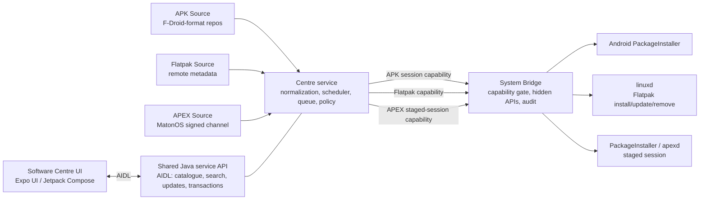

# MatonOS Software Centre

This document defines one MatonOS-owned application centre for Android APKs,
Flatpaks and MatonOS APEX updates. It replaces the planned F-Droid client or
small app-only updater in the MatonOS Settings plan. Operating-system image
updates remain a separate A/B `update_engine` feature; add-on slot updates
remain with their owning add-on design.

## Goals and boundaries

The UI, catalogue, search, normalized metadata, update checks and schedule,
transaction queue, progress model, trust prompts, and installed-app display
are shared. A **Source** adapter translates one package format's repository
or channel into this shared contract. There are three Sources:

1. **APK** — F-Droid-format repositories, including user-added repositories.
2. **Flatpak** — Flatpak remotes, including user-added remotes. All Flatpak
   work goes through linuxd via a System Bridge capability.
3. **APEX** — only MatonOS updatable APEXes, such as
   `com.matonos.flatpak`, from MatonOS's own signed channel. Users cannot add
   APEX repositories. Install is staged and follows APEX reboot or
   rebootless activation requirements.

The centre does not update the OS image, bootloader, kernel add-ons, or
arbitrary files. APK and Flatpak updates retain their format-specific
signatures and identity; the centre never re-signs third-party payloads.

## Architecture



### Placement recommendation

Put the catalogue and transaction coordinator in a dedicated privileged
MatonOS Software Centre service app, built as a Gradle Java application and
shipped as a normal system app with its own pinned signing key. Keep the
Expo/Compose-facing UI as a client. The service owns shared policy and the
three Java Source adapters; it has no direct hidden-API access and no generic
root or shell path.

Use the System Bridge only for narrowly named capabilities that require
privilege: creating/committing a PackageInstaller session for APKs, invoking
linuxd operations for Flatpak, and creating/committing an APEX staged session.
The bridge checks the caller package, pinned certificate, capability
allowlist, and consent; it audits grants, denials and privileged calls. Do
not put catalogue parsing, scheduling or generic transaction orchestration
in the bridge. Do not let a Source adapter call package manager internals,
linuxd, ostree, or shell commands directly.

Built-in MatonOS apps signed by their pinned per-app keys receive their
declared bridge capabilities by default. Third-party clients require explicit
per-capability user consent. A user-added repository/remote is separately
consented to in the shared trust flow; that consent does not grant its apps
privileged bridge access. The bridge remains the only route to hidden APIs,
with certificate allowlists, capability checks and the shared audit log as
specified in `CLAUDE.md`.

### UI AIDL contract

Expose a versioned `org.matonos.softwarecentre` AIDL service to the UI. Prefer
typed parcelables and one-way callbacks over a JSON-only UI interface. Initial
operations:

```text
listSources()                         -> SourceInfo[]
search(query, filters, pageToken)     -> CataloguePage
getDetails(packageKey)                -> PackageDetails
listInstalled(filters)                -> InstalledPage
checkUpdates(scope)                   -> UpdateSummary
enqueue(operationRequest)             -> transactionId
cancel(transactionId)                 -> CancelResult
observe(transactionId, listener)      -> current state + progress events
observeQueue(listener)                -> queue snapshot + events
```

`packageKey` is a stable source-qualified identifier, never an untrusted path
or command. Search results, details, installed rows, and updates use a common
metadata model: display name, summary, description, icon references, source,
package key, installed/candidate versions, permissions/manifest claims when
available, size when known, and trust/signing identity. Missing metadata is
represented as unknown, not inferred as safe. The API is versioned so Expo UI
and Gradle Java service can update independently within a release.

### Java Source interface

The adapter API is Java, not Kotlin. The following is an interface sketch;
payload bytes and privileged execution remain behind the service/bridge
boundary.

```java
public interface Source {
  SourceId id();
  SourceKind kind();
  CompletionStage<CataloguePage> search(SearchQuery query, PageToken page);
  CompletionStage<PackageDetails> details(PackageKey key);
  CompletionStage<List<InstalledPackage>> installed();
  CompletionStage<List<UpdateCandidate>> checkUpdates(UpdateScope scope);
  CompletionStage<PreparedOperation> prepare(OperationRequest request,
                                               CancellationToken cancel);
  CompletionStage<TrustAssessment> assessTrust(PreparedOperation operation);
  CompletionStage<TransactionHandle> execute(PreparedOperation operation,
                                               ProgressSink progress,
                                               CancellationToken cancel);
  CompletionStage<RollbackResult> rollback(TransactionHandle transaction);
}
```

`SourceKind` has exactly `APK`, `FLATPAK`, `APEX`. `TrustAssessment` includes
the source identity, normalized origin, signing/key fingerprints, previous
fingerprint where rotation applies, verification result, whether trust is
built-in or user-added, and whether a prompt is required. A Source reports
capabilities and limitations; the shared scheduler and UI decide when to
check and how to present results.

### Reuse and licensing

F-Droid's client application is GPL-3.0-or-later and is not reusable in the
MatonOS image under the no-GPLv3/LGPLv3 rule. The upstream `libs/README.md`
describes its **download**, **index** and Android **database** libraries as
Apache-2.0; those are license-compatible starting points for review, unlike
the client. The download and index modules describe themselves as Kotlin
multiplatform libraries, and the database is Android/Room based. MatonOS apps
are Gradle Java, not Kotlin: do not pull these Kotlin modules into the app as
dependencies. Reuse the F-Droid format/protocol knowledge and implement the
needed Java components, or separately review a Java-compatible extraction.
Before any code reuse, pin a revision and audit its complete transitive
dependency and packaged-license set; the upstream module-level Apache notice
does not establish the license of every dependency. No GPLv3 or LGPLv3 code
may enter the image.

Upstream references: [F-Droid client license](https://gitlab.com/fdroid/fdroidclient/-/raw/master/LICENSE),
[F-Droid reusable libraries and module license](https://gitlab.com/fdroid/fdroidclient/-/raw/master/libs/README.md).

## Source-specific behavior

### APK Source: F-Droid-format repositories

Parse signed F-Droid-format repository indexes and expose app metadata and
APK variants through the shared model. Repository trust pins the index
signing key fingerprint; APK installation additionally verifies package
identity and Android signing-certificate continuity against the installed
package. Reject unsigned indexes, malformed metadata, package-name swaps,
certificate mismatches and downgrade attempts unless a separately designed
developer override is enabled. APK replacement is an atomic
PackageInstaller session (including split APK sets); it does not promise a
rollback after a successful commit. Uninstall is not generally reversible.

The official F-Droid repository is a source that can be enabled by MatonOS
policy; custom repositories are supported after an explicit trust prompt.
The APK Source does not silently add repositories merely because an app
metadata record links to one.

### Flatpak Source: remotes through linuxd

Source discovery, installed state, install/update/remove and progress go
through the Flatpak service capability in the System Bridge. The Android
service must never invoke the Flatpak CLI, `ostree`, or linuxd directly.
linuxd alone owns repository writes, deployments, runtime references and
stub reconciliation. Preserve the repository's verified publish design:
download/stage as AID 2902, verify the staged objects with
`pull-local --untrusted --gpg-verify` and the configured signing keys, publish
only the verified bytes, then generate/update the signed launcher stub.
**Never use `ostree show` as a verification check**; its status is not a reliable signature
failure signal. Consult `install/linuxd/CODE-STORAGE-r24.md` and the current
linuxd handover for the implementation contract.

Remote signing-key fingerprints are shown and pinned at add time. Flathub may
be preconfigured as a built-in trusted remote; custom remotes require the
shared explicit trust flow. Trusting a remote does not bypass Flatpak sandbox
permission review or grant Android/bridge capabilities to its apps. If an
operation fails before publish, discard staging. Publish/deployment changes
must be atomic from the installed-app view; retain the prior deployment until
the new one is verified and activated. Rollback uses Flatpak's retained
deployment where possible; otherwise report that rollback is unavailable and
leave the prior version intact until commit.

### APEX Source: MatonOS signed channel only

The APEX Source has a fixed MatonOS channel and product allowlist. It accepts
no custom URL, repository, key or channel from a user or app. Channel
metadata is authenticated with the MatonOS release signing policy and binds
APEX package name, version, digest, signing key identity, minimum OS/release
and activation requirements. The service offers only allowlisted updateable
APEXes, such as `com.matonos.flatpak`.

Stage APEX updates using PackageInstaller's staged-session mechanism and
apexd. Validate package name, version monotonicity, digest and expected APEX
signing key before commit. Most APEX updates activate on reboot; support
rebootless activation only for APEXes and platform states explicitly marked
safe by Android. Show “restart required” before queuing a reboot-required
update, and never initiate a reboot without a clear user action. APEX
activation is an atomic platform transaction; apexd rollback on failed boot
is the recovery path. Live images with volatile `/data` cannot promise to
retain staged APEX updates across power loss; disclose that limitation and
deliver those updates in a new live image. APEX private signing keys are
offline release keys: **never on the device, build host or CI**. The device
may carry only the verification material/platform trust configuration
required by Android.

## Shared transactions and progress

The service owns one durable operation queue, deduplicated by source-qualified
package key and target version. Persist request, phase, progress, result and
reboot requirement before exposing each state to the UI. A transaction moves
through `QUEUED → PREPARING → VERIFYING → AWAITING_TRUST` (when needed) `→
STAGING → COMMITTING → COMPLETE`, with terminal `FAILED` or `CANCELLED`.
Recovery after process death queries the backend's authoritative installed
state and resumes or marks the operation indeterminate; it must not replay a
commit blindly. Serialize conflicting operations for one package and allow
backend concurrency limits (initially one Flatpak mutation at a time).

Atomicity and rollback are backend-specific:

| Backend | Commit boundary | Failure recovery |
|---|---|---|
| APK | PackageInstaller session commit | Session abort before commit; after commit, install prior APK only if its verified bytes and signing identity are still available. No general uninstall rollback. |
| Flatpak | linuxd verifies, deploys and atomically selects the new deployment/stub | Discard staging before publish; keep previous deployment until activation; roll back to it if retained. |
| APEX | Commit staged PackageInstaller session; activate according to apexd | Staged session can be abandoned before activation; after activation rely on apexd boot rollback and report reboot requirement. |

Progress is a shared event model (`phase`, `fraction?`, `bytesDone?`,
`bytesTotal?`, `messageKey`, `canCancel`, timestamp). Render an indeterminate
bar when a backend does not report a percentage. Cancellation is honored
before a backend's commit boundary; after that boundary the UI says it is
finishing and does not claim cancellation. APEX progress separately reports
download/staging and `rebootRequired`; reboot is never disguised as install
completion.

## Update checks and scheduling

One scheduler owns refresh timing for all Sources and one user-facing update
list. It applies shared policy, backoff and jitter, then asks each Source to
check its configured origins. It does not poll independently per screen.
Show last successful check and per-source failures; offline/error states must
not erase cached catalogue data or imply that no updates exist.

Suggested defaults for the first release (final values remain open): check
once daily when online, plus a manual “Check now”; defer large downloads on
metered networks unless the user opts in; permit metadata-only checks on
metered networks if configured; defer automatic downloads and installation
when battery is low or the device is on battery, with a user override for
manual installs. Never auto-commit an update while prompting is required.
APEX downloads may stage in the background after trust is established, but
activation/reboot is explicit. Respect Android background execution limits;
use a durable scheduled job and unique work rather than a permanently running
service.

## Repository and remote trust

All origin handling uses one shared trust flow before a new or changed
repository/remote is persisted:

1. Parse and canonicalize the URL, reject unsupported schemes, credentials,
   fragments and unsafe redirects, and normalize internationalized hostnames
   with IDN-to-ASCII **punycode (`xn--`) conversion here**. curl has no IDN
   support, so every backend receives the canonical ASCII host; never let
   each backend make its own conversion choice.
2. Fetch metadata without treating TLS alone as package authenticity. Show
   the normalized origin and signing-key fingerprint(s), key algorithm,
   source type, and whether the origin is built-in or user-added.
3. Require explicit user consent for a user-added origin and pin its signing
   identity. Built-in MatonOS apps and built-in sources use their image-pinned
   default trust. Third-party app consent and repository trust are distinct.
4. On subsequent refreshes, require a matching fingerprint. A legitimate
   key rotation must be authenticated by the old key or a separately
   published MatonOS-approved transition; show old and new fingerprints and
   require confirmation when continuity cannot be proven. Never silently
   replace a pin after TLS, DNS or redirect changes.
5. Keep APEX channel trust outside this user flow: only the fixed MatonOS
   channel and release trust configuration are accepted.

Persist trust by source ID, canonical origin and key fingerprint. Removing a
source revokes future downloads from it but does not silently uninstall its
packages. Installed package identity records the source and signing identity
used at install, so updates from another source require explicit migration
review.

## Security review points

- Threat-model malicious indexes, remotes, redirects, DNS changes, key
  rotation, replay/downgrade, archive/path traversal, oversized metadata,
  compromised mirrors, partial downloads and service/UI process death.
- Keep network parsing and archive handling out of the bridge. Bound response
  sizes, timeouts, redirect count, decompression, database growth and worker
  concurrency; use safe temporary files and atomic rename.
- Make backend capabilities narrow and typed. Authorize by unique package UID
  plus current signing certificate; deny ambiguous shared UIDs. Recheck
  certificate and allowlist at each privileged operation and audit calls.
- APK: verify index signature, artifact digest, package name and Android
  signer continuity immediately before install; reject downgrade and
  unexpected split sets.
- Flatpak: preserve linuxd's AID 2902 staging, verified
  `pull-local --untrusted --gpg-verify` publication and stub-signing boundary; no direct
  Binder from Flatpak sandboxes, no bridge access from payloads and no
  `ostree show` verification.
- APEX: fixed package/channel allowlist, monotonic versions, pinned release
  identity, staged-session checks and boot rollback. Release private keys
  never enter device/build/CI systems.
- Prevent confused-deputy behavior: repository metadata cannot request bridge
  capabilities, change scheduler policy, start services, or supply arbitrary
  shell arguments. The only install target is a validated source-qualified
  package key.
- Check Android permission declarations against the OS-release allowlist;
  an app update cannot acquire newly privileged permissions until an OS
  release explicitly adds them.
- Review licensing of every source module and transitive dependency against
  the no-GPLv3/LGPLv3 image rule before import.

## Phased plan

1. **Shared skeleton and APK MVP:** Java service/AIDL, shared metadata and
   transaction types, built-in F-Droid-format repository, signed-index and
   APK-signer verification, search/details/installed/update list, explicit
   install prompts and PackageInstaller sessions. No silent third-party
   source additions.
2. **Flatpak integration:** replace the current Flathub-only store calls with
   the Source contract; route every operation through the existing bridge and
   linuxd pipeline; show remote fingerprints, permissions, progress and
   installed state. Then add user-managed custom remotes.
3. **Trust and scheduler hardening:** shared punycode/canonical-origin flow,
   user-added APK repositories, key-rotation UX, durable queue, metered and
   battery rules, recovery and audit review.
4. **APEX channel:** fixed MatonOS channel manifest and allowlist, staged
   sessions, version/signature validation, reboot-required UX and apexd
   rollback reporting. Start with `com.matonos.flatpak`; release keys stay
   offline.
5. **Polish and migration:** installed-app reconciliation, accessible
   progress, source health, release permission policy, and removal of the
   obsolete F-Droid client/privileged-extension plan once the centre covers
   its required update set.

## Open questions

- Which F-Droid-format index versions and compatibility fields are required
  for the first APK Source, and which Java implementation will be maintained?
- Is the official F-Droid repository built-in by default, optional, or
  enabled only for a curated set of packages? Is MatonOS's own app repo a
  separate built-in origin?
- What Android PackageInstaller capabilities are available to a privileged
  app versus a bridge-mediated session on the chosen AOSP revision?
- Should trusted APK sources allow unattended download only, or also
  unattended installation? Initial design assumes user confirmation before
  commit.
- What are the default daily check time, low-battery threshold, charging
  policy and metered-network behavior?
- Which APKs, Flatpaks and APEXes are eligible for rollback retention, and
  what storage budget bounds retained APKs/Flatpak deployments?
- Which MatonOS APEXes beyond `com.matonos.flatpak` are updateable, and which
  are safe for rebootless activation?
- How are MatonOS channel manifests published, signed, mirrored and revoked
  while keeping all private signing material offline?
- How should the centre present live-image APEX updates that cannot survive
  reboot because `/data` is volatile?
